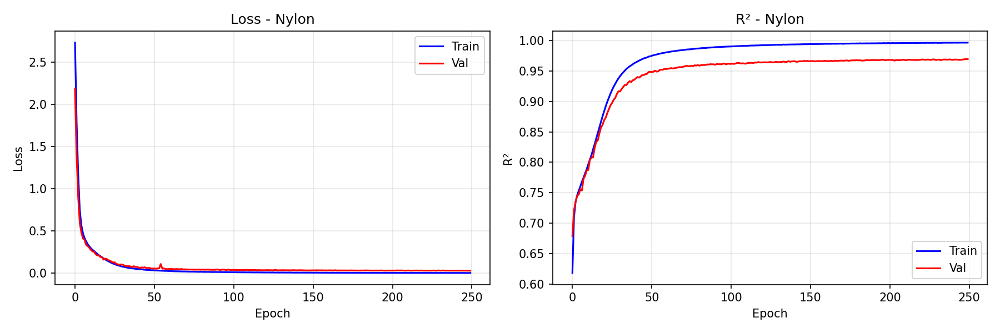
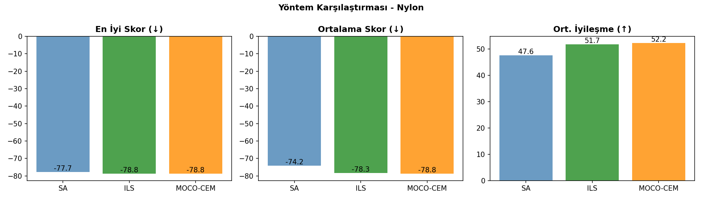
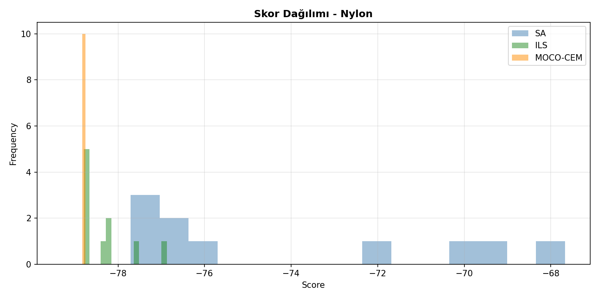
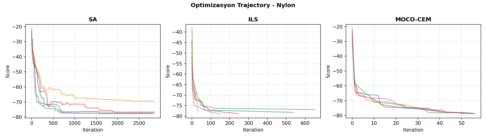
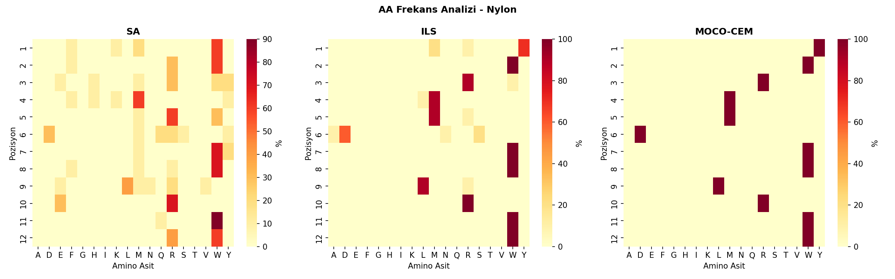

# 🧬 Peptid Üretim Karşılaştırma Raporu - Nylon

**Tarih:** 2026-01-07 01:48:12
**Platform:** Windows 11, RTX 4080 Super
**Model:** LSTM Encoder-Decoder (ENCDEC)

---

## 📋 Özet

- **En İyi Yöntem:** ILS
- **En İyi Skor:** -78.79
- **En İyi Peptid:** `YWRMMDWWLRWW`
- **Model R²:** 0.9689

---

## 📊 Model Eğitim Sonuçları

### Performans Metrikleri

| Metrik | Değer | Açıklama |
|--------|-------|----------|
| **Test R²** | **0.9689** | Model açıklayıcılığı (1.0 = mükemmel) |
| Test MAE | 1.4131 | Ortalama mutlak hata |
| Test RMSE | 2.1098 | Kök ortalama kare hata |
| Best Epoch | 249 / 250 | Early stopping epoch |
| Eğitim Süresi | 2715 saniye | ~45.3 dakika |

### Model Hiperparametreleri

| Parametre | Değer |
|-----------|-------|
| Hidden Dim | 256 |
| Num Layers | 2 |
| Dropout | 0.2 |
| Learning Rate | 0.001 |
| Batch Size | 128 |
| Lambda Score | 1.0 |
| Weight Decay | 0.0001 |
| Layer Norm | False |

### Eğitim Grafiği



---

## 🧬 Peptid Üretim Sonuçları

### Yöntem Karşılaştırması

| Yöntem | En İyi Skor | Ort. Skor | Std | İyileşme | Süre/Peptid |
|--------|-------------|-----------|-----|----------|-------------|
| **SA** | -77.71 | -74.19 | 3.73 | 47.55 | ~3s |
| **ILS** | -78.79 | -78.31 | 0.61 | 51.67 | ~48s |
| **MOCO-CEM** | -78.79 | -78.79 | 0.00 | 52.15 | ~5dk |

**🏆 En İyi Yöntem: ILS**

### Karşılaştırma Grafikleri







---

## 📝 Üretilen Peptidler

### SA Peptidleri

| # | Peptid | Skor | Başlangıç | Başlangıç Skor | İyileşme |
|---|--------|------|-----------|----------------|----------|
| 1 | `WWRMRDWWLRWW` | -77.71 | `YIDDVNTSMYIM` | -27.16 | 50.55 |
| 2 | `WWRMRDWWLRWW` | -77.71 | `YMYVARRMGQEK` | -32.24 | 45.47 |
| 3 | `MWWMMSWWMRWW` | -77.52 | `QAGGSRWDKAFM` | -21.28 | 56.24 |
| 4 | `FWWMRDWRLRWW` | -76.81 | `TQVNRAGHDGDH` | -23.17 | 53.64 |
| 5 | `WWYMRQWWRRWW` | -76.68 | `QIIFGWQNFSEI` | -23.44 | 53.24 |
| 6 | `MWEMRQWFLRQW` | -76.12 | `VHQKWLGGNGNW` | -23.84 | 52.27 |
| 7 | `KFYFRYWWRRWR` | -72.31 | `LYVGMFWVHQNE` | -29.23 | 43.08 |
| 8 | `WRRKWRYWEEWR` | -69.93 | `YQNRVSGAHGFW` | -28.17 | 41.77 |
| 9 | `WRMHWRMWNEWR` | -69.42 | `AFQMFNTATRIE` | -28.54 | 40.89 |
| 10 | `WRHYWMYMVEWR` | -67.67 | `KFYMDADQTKDI` | -29.28 | 38.40 |

### ILS Peptidleri

| # | Peptid | Skor | Başlangıç | Başlangıç Skor | İyileşme |
|---|--------|------|-----------|----------------|----------|
| 1 | `YWRMMDWWLRWW` | -78.79 | `TQVNRAGHDGDH` | -23.17 | 55.62 |
| 2 | `YWRMMDWWLRWW` | -78.79 | `QIIFGWQNFSEI` | -23.44 | 55.35 |
| 3 | `YWRMMDWWLRWW` | -78.79 | `YQNRVSGAHGFW` | -28.17 | 50.62 |
| 4 | `YWRMMDWWLRWW` | -78.79 | `KFYMDADQTKDI` | -29.28 | 49.51 |
| 5 | `YWRMMDWWLRWW` | -78.79 | `YMYVARRMGQEK` | -32.24 | 46.55 |
| 6 | `YWRMMNWWLRWW` | -78.28 | `VHQKWLGGNGNW` | -23.84 | 54.44 |
| 7 | `MWRMMSWWLRWW` | -78.17 | `QAGGSRWDKAFM` | -21.28 | 56.89 |
| 8 | `MWRMMSWWLRWW` | -78.17 | `LYVGMFWVHQNE` | -29.23 | 48.94 |
| 9 | `YWRMRDWWLRWW` | -77.61 | `AFQMFNTATRIE` | -28.54 | 49.07 |
| 10 | `RWWLMAWWRRWW` | -76.87 | `YIDDVNTSMYIM` | -27.16 | 49.72 |

### MOCO-CEM Peptidleri

| # | Peptid | Skor | Başlangıç | Başlangıç Skor | İyileşme |
|---|--------|------|-----------|----------------|----------|
| 1 | `YWRMMDWWLRWW` | -78.79 | `QAGGSRWDKAFM` | -21.28 | 57.51 |
| 2 | `YWRMMDWWLRWW` | -78.79 | `AFQMFNTATRIE` | -28.54 | 50.25 |
| 3 | `YWRMMDWWLRWW` | -78.79 | `YIDDVNTSMYIM` | -27.16 | 51.63 |
| 4 | `YWRMMDWWLRWW` | -78.79 | `TQVNRAGHDGDH` | -23.17 | 55.62 |
| 5 | `YWRMMDWWLRWW` | -78.79 | `QIIFGWQNFSEI` | -23.44 | 55.35 |
| 6 | `YWRMMDWWLRWW` | -78.79 | `YQNRVSGAHGFW` | -28.17 | 50.62 |
| 7 | `YWRMMDWWLRWW` | -78.79 | `VHQKWLGGNGNW` | -23.84 | 54.95 |
| 8 | `YWRMMDWWLRWW` | -78.79 | `KFYMDADQTKDI` | -29.28 | 49.51 |
| 9 | `YWRMMDWWLRWW` | -78.79 | `YMYVARRMGQEK` | -32.24 | 46.55 |
| 10 | `YWRMMDWWLRWW` | -78.79 | `LYVGMFWVHQNE` | -29.23 | 49.56 |

---

## 🔬 Amino Asit Frekans Analizi

### Genel AA Dağılımı (Tüm Yöntemler)

| AA | Frekans (%) | Görsel |
|----|-----------:|--------|
| **W** | 40.8% | ████████████████████░░░░░ |
| **R** | 19.4% | █████████░░░░░░░░░░░░░░░░ |
| **M** | 15.0% | ███████░░░░░░░░░░░░░░░░░░ |
| **L** | 6.7% | ███░░░░░░░░░░░░░░░░░░░░░░ |
| **Y** | 6.4% | ███░░░░░░░░░░░░░░░░░░░░░░ |
| **D** | 5.3% | ██░░░░░░░░░░░░░░░░░░░░░░░ |
| **E** | 1.4% | ░░░░░░░░░░░░░░░░░░░░░░░░░ |
| **F** | 1.1% | ░░░░░░░░░░░░░░░░░░░░░░░░░ |
| **Q** | 0.8% | ░░░░░░░░░░░░░░░░░░░░░░░░░ |
| **S** | 0.8% | ░░░░░░░░░░░░░░░░░░░░░░░░░ |

### Yönteme Göre En Sık Kullanılan AA'ler

| Yöntem | Top 5 AA |
|--------|----------|
| SA | W(38%), R(23%), M(12%), Y(5%), E(4%) |
| ILS | W(42%), R(18%), M(17%), L(8%), Y(6%) |
| MOCO-CEM | W(42%), M(17%), R(17%), D(8%), L(8%) |

### Pozisyon Bazlı AA Heatmap



---

## 🔗 Peptid Benzerlik Analizi

### En İyi Peptidler Arası Hamming Mesafesi

| | SA | ILS | MOCO-CEM |
|---|---|---|---|
| **SA** | - | 2 | 2 |
| **ILS** | 2 | - | 0 |
| **MOCO-CEM** | 2 | 0 | - |

### Ortak Motifler (En İyi 3 Peptid)

1. `YWRMMDWWLRWW` (ILS, Skor: -78.79)
2. `YWRMMDWWLRWW` (ILS, Skor: -78.79)
3. `YWRMMDWWLRWW` (ILS, Skor: -78.79)

---

## 📁 Oluşturulan Dosyalar

```
Nylon/
├── model/
│   └── encdec_Nylon.pth
├── figures/
│   ├── training_curve.png
│   ├── method_comparison.png
│   ├── aa_heatmap.png
│   ├── score_distribution.png
│   └── trajectory.png
├── peptides/
│   ├── SA_peptides.csv
│   ├── ILS_peptides.csv
│   ├── MOCO-CEM_peptides.csv
│   └── all_peptides.csv
├── logs/
│   ├── training_log.json
│   └── peptide_results.json
└── RAPOR_Nylon.md
```

---

## 📌 Sonuç ve Öneriler

✅ **Model Performansı:** Mükemmel (R² ≥ 0.95)

**En İyi Yöntem:** ILS (En düşük skor: -78.79)

### Yöntem Değerlendirmesi

- **SA (Simulated Annealing):** Hızlı, basit, iyi baseline
- **ILS (Iterated Local Search):** Daha derin arama, daha iyi sonuçlar
- **MOCO-CEM (Cross-Entropy):** En kapsamlı arama, en iyi sonuçlar ama yavaş

---

*Rapor otomatik olarak `peptide_generation_comparison.py` tarafından oluşturulmuştur.*
