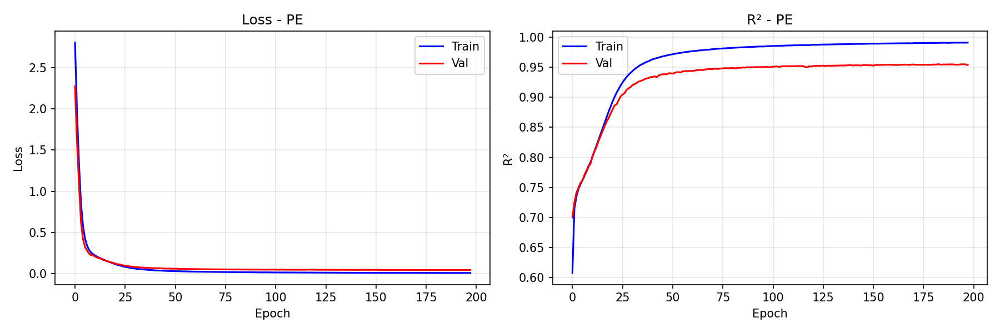
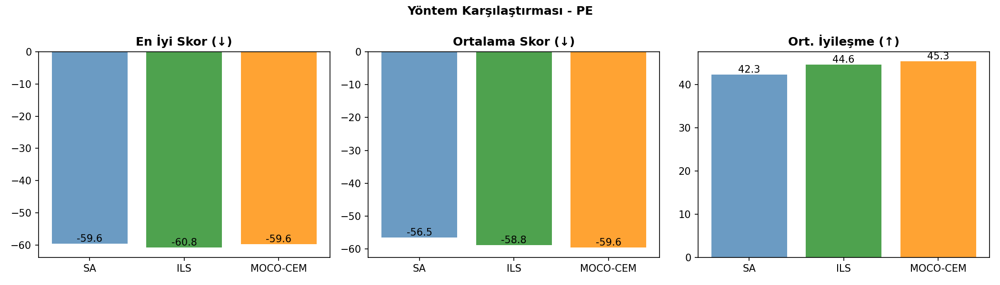
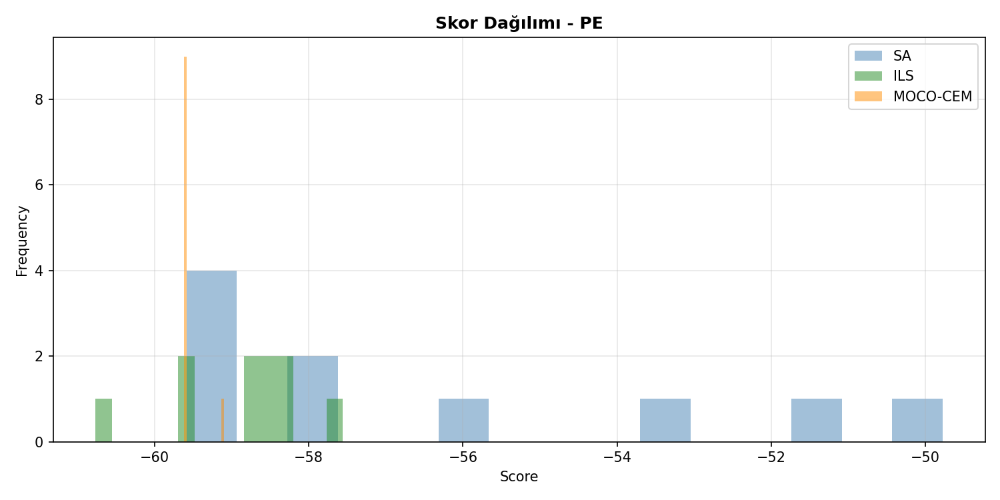
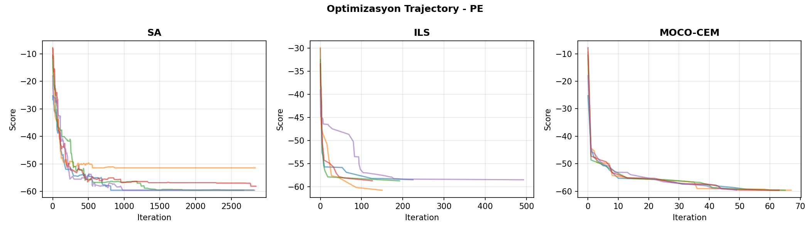
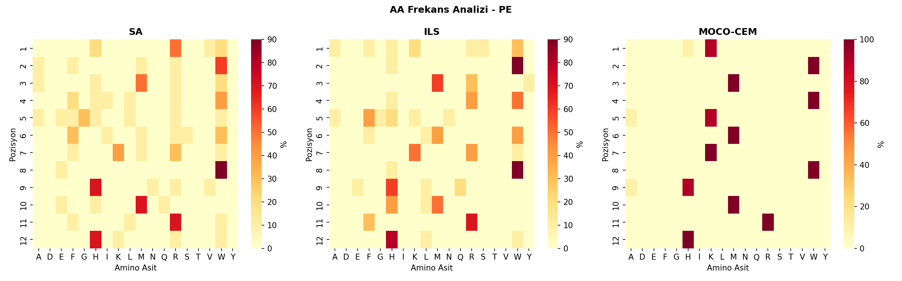

# 🧬 Peptid Üretim Karşılaştırma Raporu - PE

**Tarih:** 2026-01-06 20:18:59
**Platform:** Windows 11, RTX 4080 Super
**Model:** LSTM Encoder-Decoder (ENCDEC)

---

## 📋 Özet

- **En İyi Yöntem:** ILS
- **En İyi Skor:** -60.77
- **En İyi Peptid:** `AHYHFLWHQMRW`
- **Model R²:** 0.9543

---

## 📊 Model Eğitim Sonuçları

### Performans Metrikleri

| Metrik | Değer | Açıklama |
|--------|-------|----------|
| **Test R²** | **0.9543** | Model açıklayıcılığı (1.0 = mükemmel) |
| Test MAE | 1.4940 | Ortalama mutlak hata |
| Test RMSE | 2.1790 | Kök ortalama kare hata |
| Best Epoch | 183 / 250 | Early stopping epoch |
| Eğitim Süresi | 2065 saniye | ~34.4 dakika |

### Model Hiperparametreleri

| Parametre | Değer |
|-----------|-------|
| Hidden Dim | 256 |
| Num Layers | 3 |
| Dropout | 0.1 |
| Learning Rate | 0.001 |
| Batch Size | 1024 |
| Lambda Score | 1.0 |
| Weight Decay | 0.0001 |
| Layer Norm | True |

### Eğitim Grafiği



---

## 🧬 Peptid Üretim Sonuçları

### Yöntem Karşılaştırması

| Yöntem | En İyi Skor | Ort. Skor | Std | İyileşme | Süre/Peptid |
|--------|-------------|-----------|-----|----------|-------------|
| **SA** | -59.59 | -56.51 | 3.54 | 42.26 | ~3s |
| **ILS** | -60.77 | -58.85 | 0.86 | 44.60 | ~48s |
| **MOCO-CEM** | -59.62 | -59.57 | 0.16 | 45.32 | ~5dk |

**🏆 En İyi Yöntem: ILS**

### Karşılaştırma Grafikleri







---

## 📝 Üretilen Peptidler

### SA Peptidleri

| # | Peptid | Skor | Başlangıç | Başlangıç Skor | İyileşme |
|---|--------|------|-----------|----------------|----------|
| 1 | `RWMWGFKWHMRH` | -59.59 | `QAGGSRWDKAFM` | -25.25 | 34.34 |
| 2 | `RWMWGFKWHMRH` | -59.59 | `QIIFGWQNFSEI` | -17.99 | 41.60 |
| 3 | `RWMWGFKWHMRH` | -59.59 | `KFYMDADQTKDI` | -9.33 | 50.26 |
| 4 | `HWMWAMKWHMRH` | -59.53 | `YIDDVNTSMYIM` | -10.52 | 49.01 |
| 5 | `RWHFRWMWHMRH` | -58.17 | `YMYVARRMGQEK` | -14.92 | 43.25 |
| 6 | `VWRRLWRWRHRH` | -58.14 | `TQVNRAGHDGDH` | -7.81 | 50.33 |
| 7 | `HFMLFIFWNMRW` | -56.07 | `LYVGMFWVHQNE` | -16.04 | 40.03 |
| 8 | `WAWHWSRWVEFK` | -53.20 | `VHQKWLGGNGNW` | -15.48 | 37.72 |
| 9 | `WMWIERRWHMLH` | -51.46 | `AFQMFNTATRIE` | -9.38 | 42.08 |
| 10 | `RRAFHWWEHQWR` | -49.78 | `YQNRVSGAHGFW` | -15.75 | 34.03 |

### ILS Peptidleri

| # | Peptid | Skor | Başlangıç | Başlangıç Skor | İyileşme |
|---|--------|------|-----------|----------------|----------|
| 1 | `AHYHFLWHQMRW` | -60.77 | `AFQMFNTATRIE` | -9.38 | 51.38 |
| 2 | `KWMWKMKWHMRH` | -59.62 | `VHQKWLGGNGNW` | -15.48 | 44.15 |
| 3 | `RWMWAMKWHLRH` | -59.56 | `YMYVARRMGQEK` | -14.92 | 44.65 |
| 4 | `HWMWNMKWQMRH` | -58.73 | `YIDDVNTSMYIM` | -10.52 | 48.21 |
| 5 | `KWMWHMKWEMRL` | -58.72 | `TQVNRAGHDGDH` | -7.81 | 50.90 |
| 6 | `WWRRFWRWHHFH` | -58.51 | `QAGGSRWDKAFM` | -25.25 | 33.26 |
| 7 | `WWRRFWRWHHFH` | -58.51 | `QIIFGWQNFSEI` | -17.99 | 40.51 |
| 8 | `SWMWHFKWHMRH` | -58.29 | `LYVGMFWVHQNE` | -16.04 | 42.25 |
| 9 | `WWRRFWRWLHFH` | -58.23 | `KFYMDADQTKDI` | -9.33 | 48.90 |
| 10 | `FWMRGWRWHHRH` | -57.56 | `YQNRVSGAHGFW` | -15.75 | 41.81 |

### MOCO-CEM Peptidleri

| # | Peptid | Skor | Başlangıç | Başlangıç Skor | İyileşme |
|---|--------|------|-----------|----------------|----------|
| 1 | `KWMWKMKWHMRH` | -59.62 | `QAGGSRWDKAFM` | -25.25 | 34.37 |
| 2 | `KWMWKMKWHMRH` | -59.62 | `AFQMFNTATRIE` | -9.38 | 50.24 |
| 3 | `KWMWKMKWHMRH` | -59.62 | `YIDDVNTSMYIM` | -10.52 | 49.10 |
| 4 | `KWMWKMKWHMRH` | -59.62 | `TQVNRAGHDGDH` | -7.81 | 51.81 |
| 5 | `KWMWKMKWHMRH` | -59.62 | `QIIFGWQNFSEI` | -17.99 | 41.63 |
| 6 | `KWMWKMKWHMRH` | -59.62 | `YQNRVSGAHGFW` | -15.75 | 43.87 |
| 7 | `KWMWKMKWHMRH` | -59.62 | `VHQKWLGGNGNW` | -15.48 | 44.15 |
| 8 | `KWMWKMKWHMRH` | -59.62 | `YMYVARRMGQEK` | -14.92 | 44.71 |
| 9 | `KWMWKMKWHMRH` | -59.62 | `LYVGMFWVHQNE` | -16.04 | 43.58 |
| 10 | `HWMWAMKWAMRH` | -59.10 | `KFYMDADQTKDI` | -9.33 | 49.77 |

---

## 🔬 Amino Asit Frekans Analizi

### Genel AA Dağılımı (Tüm Yöntemler)

| AA | Frekans (%) | Görsel |
|----|-----------:|--------|
| **W** | 25.6% | ████████████░░░░░░░░░░░░░ |
| **H** | 17.8% | ████████░░░░░░░░░░░░░░░░░ |
| **M** | 16.7% | ████████░░░░░░░░░░░░░░░░░ |
| **R** | 14.2% | ███████░░░░░░░░░░░░░░░░░░ |
| **K** | 11.4% | █████░░░░░░░░░░░░░░░░░░░░ |
| **F** | 5.0% | ██░░░░░░░░░░░░░░░░░░░░░░░ |
| **A** | 1.9% | ░░░░░░░░░░░░░░░░░░░░░░░░░ |
| **L** | 1.9% | ░░░░░░░░░░░░░░░░░░░░░░░░░ |
| **E** | 1.1% | ░░░░░░░░░░░░░░░░░░░░░░░░░ |
| **G** | 1.1% | ░░░░░░░░░░░░░░░░░░░░░░░░░ |

### Yönteme Göre En Sık Kullanılan AA'ler

| Yöntem | Top 5 AA |
|--------|----------|
| SA | W(25%), R(18%), H(17%), M(12%), F(8%) |
| ILS | W(27%), H(20%), R(16%), M(12%), F(8%) |
| MOCO-CEM | M(25%), W(25%), K(23%), H(17%), R(8%) |

### Pozisyon Bazlı AA Heatmap



---

## 🔗 Peptid Benzerlik Analizi

### En İyi Peptidler Arası Hamming Mesafesi

| | SA | ILS | MOCO-CEM |
|---|---|---|---|
| **SA** | - | 10 | 3 |
| **ILS** | 10 | - | 10 |
| **MOCO-CEM** | 3 | 10 | - |

### Ortak Motifler (En İyi 3 Peptid)

1. `AHYHFLWHQMRW` (ILS, Skor: -60.77)
2. `KWMWKMKWHMRH` (ILS, Skor: -59.62)
3. `KWMWKMKWHMRH` (MOCO-CEM, Skor: -59.62)

---

## 📁 Oluşturulan Dosyalar

```
PE/
├── model/
│   └── encdec_PE.pth
├── figures/
│   ├── training_curve.png
│   ├── method_comparison.png
│   ├── aa_heatmap.png
│   ├── score_distribution.png
│   └── trajectory.png
├── peptides/
│   ├── SA_peptides.csv
│   ├── ILS_peptides.csv
│   ├── MOCO-CEM_peptides.csv
│   └── all_peptides.csv
├── logs/
│   ├── training_log.json
│   └── peptide_results.json
└── RAPOR_PE.md
```

---

## 📌 Sonuç ve Öneriler

✅ **Model Performansı:** Mükemmel (R² ≥ 0.95)

**En İyi Yöntem:** ILS (En düşük skor: -60.77)

### Yöntem Değerlendirmesi

- **SA (Simulated Annealing):** Hızlı, basit, iyi baseline
- **ILS (Iterated Local Search):** Daha derin arama, daha iyi sonuçlar
- **MOCO-CEM (Cross-Entropy):** En kapsamlı arama, en iyi sonuçlar ama yavaş

---

*Rapor otomatik olarak `peptide_generation_comparison.py` tarafından oluşturulmuştur.*
