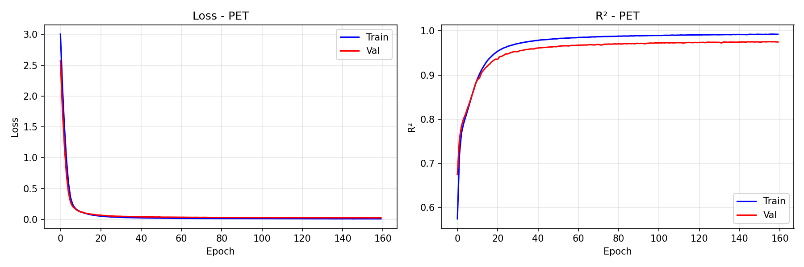
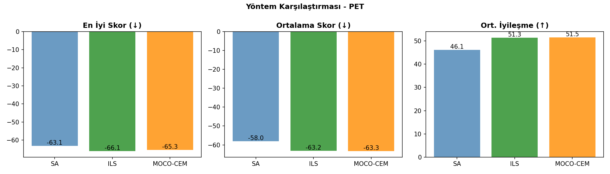
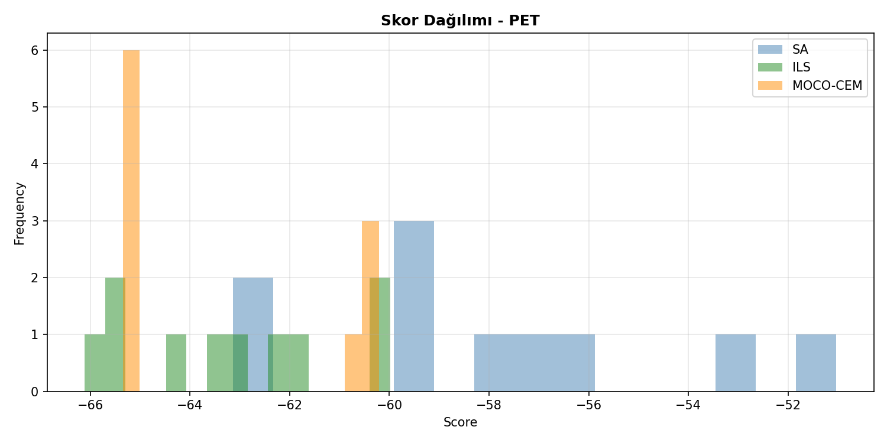
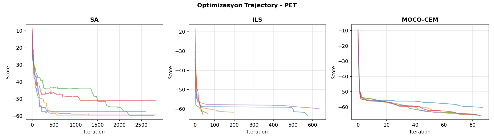
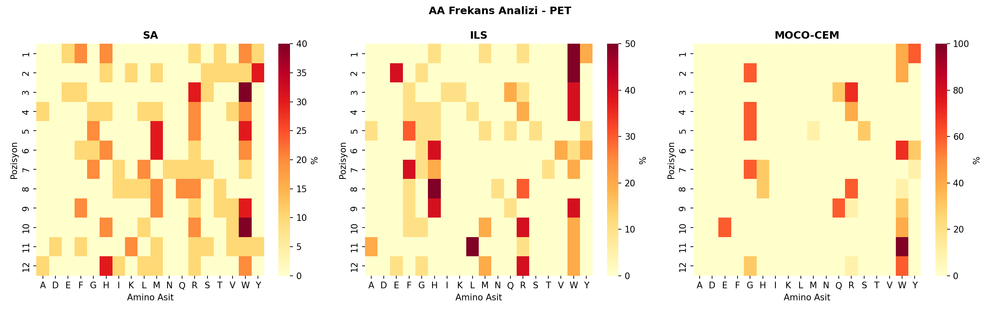

# 🧬 Peptid Üretim Karşılaştırma Raporu - PET

**Tarih:** 2026-01-06 16:49:39
**Platform:** Windows 11, RTX 4080 Super
**Model:** LSTM Encoder-Decoder (ENCDEC)

---

## 📋 Özet

- **En İyi Yöntem:** ILS
- **En İyi Skor:** -66.11
- **En İyi Peptid:** `WEWWFGFHHRLR`
- **Model R²:** 0.9751

---

## 📊 Model Eğitim Sonuçları

### Performans Metrikleri

| Metrik | Değer | Açıklama |
|--------|-------|----------|
| **Test R²** | **0.9751** | Model açıklayıcılığı (1.0 = mükemmel) |
| Test MAE | 1.5628 | Ortalama mutlak hata |
| Test RMSE | 2.2710 | Kök ortalama kare hata |
| Best Epoch | 145 / 250 | Early stopping epoch |
| Eğitim Süresi | 1272 saniye | ~21.2 dakika |

### Model Hiperparametreleri

| Parametre | Değer |
|-----------|-------|
| Hidden Dim | 256 |
| Num Layers | 2 |
| Dropout | 0.1 |
| Learning Rate | 0.001 |
| Batch Size | 1024 |
| Lambda Score | 1.0 |
| Weight Decay | 0.0001 |
| Layer Norm | True |

### Eğitim Grafiği



---

## 🧬 Peptid Üretim Sonuçları

### Yöntem Karşılaştırması

| Yöntem | En İyi Skor | Ort. Skor | Std | İyileşme | Süre/Peptid |
|--------|-------------|-----------|-----|----------|-------------|
| **SA** | -63.14 | -57.99 | 3.56 | 46.12 | ~3s |
| **ILS** | -66.11 | -63.20 | 2.08 | 51.33 | ~48s |
| **MOCO-CEM** | -65.35 | -63.33 | 2.48 | 51.46 | ~5dk |

**🏆 En İyi Yöntem: ILS**

### Karşılaştırma Grafikleri







---

## 📝 Üretilen Peptidler

### SA Peptidleri

| # | Peptid | Skor | Başlangıç | Başlangıç Skor | İyileşme |
|---|--------|------|-----------|----------------|----------|
| 1 | `HHRWWMSQFWFH` | -63.14 | `YQNRVSGAHGFW` | -10.30 | 52.84 |
| 2 | `HSRGGHGRVVDW` | -62.51 | `YMYVARRMGQEK` | -14.14 | 48.37 |
| 3 | `FVWRWHLIMWVH` | -59.57 | `YIDDVNTSMYIM` | -10.41 | 49.16 |
| 4 | `YMWWWWQLRRRM` | -59.46 | `AFQMFNTATRIE` | -12.04 | 47.42 |
| 5 | `WWFHRWNMFWKW` | -59.37 | `QIIFGWQNFSEI` | -10.75 | 48.62 |
| 6 | `EYRAGGGRTHKL` | -57.81 | `VHQKWLGGNGNW` | -11.22 | 46.59 |
| 7 | `WKSVMRWQWLWI` | -57.49 | `QAGGSRWDKAFM` | -15.49 | 42.00 |
| 8 | `FYWLRFLMWWMR` | -56.22 | `LYVGMFWVHQNE` | -16.67 | 39.55 |
| 9 | `TTWRMMIKMHSH` | -53.34 | `KFYMDADQTKDI` | -8.80 | 44.54 |
| 10 | `RYEMMMRTWRYA` | -51.04 | `TQVNRAGHDGDH` | -8.89 | 42.14 |

### ILS Peptidleri

| # | Peptid | Skor | Başlangıç | Başlangıç Skor | İyileşme |
|---|--------|------|-----------|----------------|----------|
| 1 | `WEWWFGFHHRLR` | -66.11 | `VHQKWLGGNGNW` | -11.22 | 54.89 |
| 2 | `WEWWFVFHHRLM` | -65.58 | `KFYMDADQTKDI` | -8.80 | 56.79 |
| 3 | `WEWWFVFHHRLM` | -65.58 | `LYVGMFWVHQNE` | -16.67 | 48.91 |
| 4 | `WEWWAHFHHRLR` | -64.18 | `YMYVARRMGQEK` | -14.14 | 50.04 |
| 5 | `YWIFQHWRWMAR` | -63.28 | `QAGGSRWDKAFM` | -15.49 | 47.79 |
| 6 | `YWKLHHWRWMAR` | -63.05 | `TQVNRAGHDGDH` | -8.89 | 54.16 |
| 7 | `HGRGGHGRFGLW` | -62.33 | `YIDDVNTSMYIM` | -10.41 | 51.92 |
| 8 | `MWFHMWTFQFRW` | -61.70 | `AFQMFNTATRIE` | -12.04 | 49.66 |
| 9 | `WWQRSYHHWWWG` | -60.20 | `YQNRVSGAHGFW` | -10.30 | 49.91 |
| 10 | `RWQRYYHNWWWE` | -59.99 | `QIIFGWQNFSEI` | -10.75 | 49.24 |

### MOCO-CEM Peptidleri

| # | Peptid | Skor | Başlangıç | Başlangıç Skor | İyileşme |
|---|--------|------|-----------|----------------|----------|
| 1 | `YGRGGWGRQEWW` | -65.35 | `AFQMFNTATRIE` | -12.04 | 53.31 |
| 2 | `YGRGGWGRQEWW` | -65.35 | `YIDDVNTSMYIM` | -10.41 | 54.94 |
| 3 | `YGRGGWGRQEWW` | -65.35 | `TQVNRAGHDGDH` | -8.89 | 56.45 |
| 4 | `YGRGGWGRQEWW` | -65.35 | `QIIFGWQNFSEI` | -10.75 | 54.60 |
| 5 | `YGRGGWGRQEWW` | -65.35 | `YQNRVSGAHGFW` | -10.30 | 55.05 |
| 6 | `YGRGGWGRQEWW` | -65.35 | `YMYVARRMGQEK` | -14.14 | 51.21 |
| 7 | `WWRRMWYWRWWR` | -60.57 | `KFYMDADQTKDI` | -8.80 | 51.78 |
| 8 | `WWQRSYHHWWWG` | -60.20 | `QAGGSRWDKAFM` | -15.49 | 44.71 |
| 9 | `WWQRSYHHWWWG` | -60.20 | `VHQKWLGGNGNW` | -11.22 | 48.98 |
| 10 | `WWQRSYHHWWWG` | -60.20 | `LYVGMFWVHQNE` | -16.67 | 43.53 |

---

## 🔬 Amino Asit Frekans Analizi

### Genel AA Dağılımı (Tüm Yöntemler)

| AA | Frekans (%) | Görsel |
|----|-----------:|--------|
| **W** | 26.4% | █████████████░░░░░░░░░░░░ |
| **R** | 14.4% | ███████░░░░░░░░░░░░░░░░░░ |
| **G** | 11.1% | █████░░░░░░░░░░░░░░░░░░░░ |
| **H** | 9.7% | ████░░░░░░░░░░░░░░░░░░░░░ |
| **M** | 5.8% | ██░░░░░░░░░░░░░░░░░░░░░░░ |
| **Y** | 5.6% | ██░░░░░░░░░░░░░░░░░░░░░░░ |
| **F** | 5.3% | ██░░░░░░░░░░░░░░░░░░░░░░░ |
| **Q** | 4.4% | ██░░░░░░░░░░░░░░░░░░░░░░░ |
| **E** | 3.6% | █░░░░░░░░░░░░░░░░░░░░░░░░ |
| **L** | 3.3% | █░░░░░░░░░░░░░░░░░░░░░░░░ |

### Yönteme Göre En Sık Kullanılan AA'ler

| Yöntem | Top 5 AA |
|--------|----------|
| SA | W(21%), R(14%), M(12%), H(9%), F(6%) |
| ILS | W(26%), H(15%), R(13%), F(10%), G(6%) |
| MOCO-CEM | W(32%), G(22%), R(16%), Y(8%), Q(8%) |

### Pozisyon Bazlı AA Heatmap



---

## 🔗 Peptid Benzerlik Analizi

### En İyi Peptidler Arası Hamming Mesafesi

| | SA | ILS | MOCO-CEM |
|---|---|---|---|
| **SA** | - | 11 | 11 |
| **ILS** | 11 | - | 12 |
| **MOCO-CEM** | 11 | 12 | - |

### Ortak Motifler (En İyi 3 Peptid)

1. `WEWWFGFHHRLR` (ILS, Skor: -66.11)
2. `WEWWFVFHHRLM` (ILS, Skor: -65.58)
3. `WEWWFVFHHRLM` (ILS, Skor: -65.58)

---

## 📁 Oluşturulan Dosyalar

```
PET/
├── model/
│   └── encdec_PET.pth
├── figures/
│   ├── training_curve.png
│   ├── method_comparison.png
│   ├── aa_heatmap.png
│   ├── score_distribution.png
│   └── trajectory.png
├── peptides/
│   ├── SA_peptides.csv
│   ├── ILS_peptides.csv
│   ├── MOCO-CEM_peptides.csv
│   └── all_peptides.csv
├── logs/
│   ├── training_log.json
│   └── peptide_results.json
└── RAPOR_PET.md
```

---

## 📌 Sonuç ve Öneriler

✅ **Model Performansı:** Mükemmel (R² ≥ 0.95)

**En İyi Yöntem:** ILS (En düşük skor: -66.11)

### Yöntem Değerlendirmesi

- **SA (Simulated Annealing):** Hızlı, basit, iyi baseline
- **ILS (Iterated Local Search):** Daha derin arama, daha iyi sonuçlar
- **MOCO-CEM (Cross-Entropy):** En kapsamlı arama, en iyi sonuçlar ama yavaş

---

*Rapor otomatik olarak `peptide_generation_comparison.py` tarafından oluşturulmuştur.*
