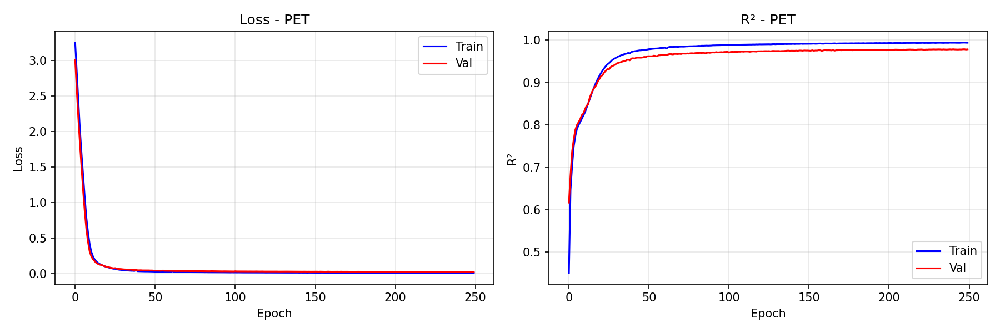
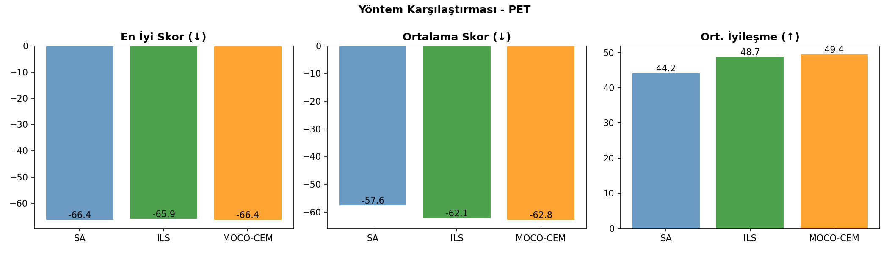
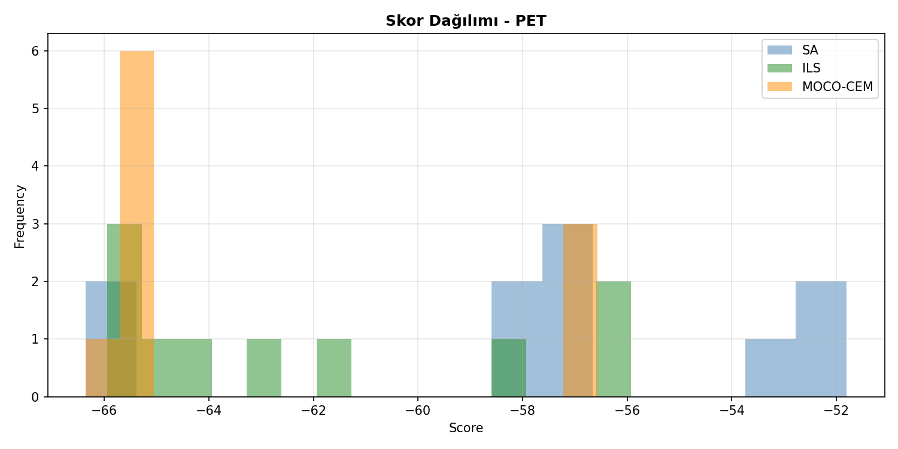
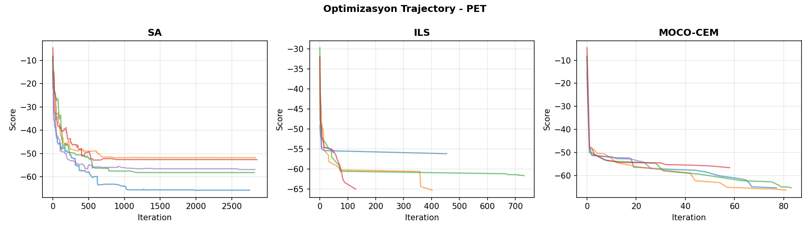
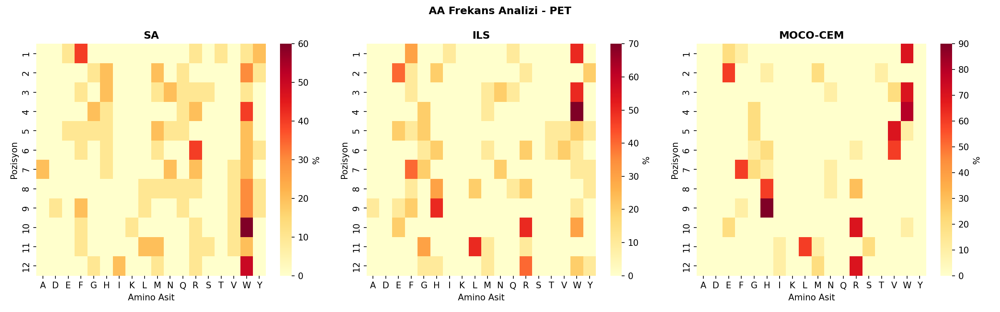

# 🧬 Peptid Üretim Karşılaştırma Raporu - PET

**Tarih:** 2026-01-18 02:55:06
**Platform:** Windows 11, RTX 4080 Super
**Model:** LSTM

---

## 📋 Özet

- **En İyi Yöntem:** SA
- **En İyi Skor:** -66.35
- **En İyi Peptid:** `FHNWWRNNFWMI`
- **Model R²:** 0.9790

---

## 📊 Model Eğitim Sonuçları

### Performans Metrikleri

| Metrik | Değer | Açıklama |
|--------|-------|----------|
| **Test R²** | **0.9790** | Model açıklayıcılığı (1.0 = mükemmel) |
| Test MAE | 1.3796 | Ortalama mutlak hata |
| Test RMSE | 2.0863 | Kök ortalama kare hata |
| Best Epoch | 248 / 250 | Early stopping epoch |
| Eğitim Süresi | 1866 saniye | ~31.1 dakika |

### Model Hiperparametreleri

| Parametre | Değer |
|-----------|-------|
| Hidden Dim | 256 |
| Num Layers | 3 |
| Dropout | 0.1 |
| Learning Rate | 0.001 |
| Batch Size | 2048 |
| Lambda Score | 1.0 |
| Weight Decay | 0.01 |
| Layer Norm | True |

### Eğitim Grafiği



---

## 🧬 Peptid Üretim Sonuçları

### Yöntem Karşılaştırması

| Yöntem | En İyi Skor | Ort. Skor | Std | İyileşme | Süre/Peptid |
|--------|-------------|-----------|-----|----------|-------------|
| **SA** | -66.35 | -57.58 | 4.85 | 44.16 | ~3s |
| **ILS** | -65.95 | -62.15 | 3.73 | 48.72 | ~48s |
| **MOCO-CEM** | -66.35 | -62.83 | 4.04 | 49.41 | ~5dk |

**🏆 En İyi Yöntem: SA**

### Karşılaştırma Grafikleri







---

## 📝 Üretilen Peptidler

### SA Peptidleri

| # | Peptid | Skor | Başlangıç | Başlangıç Skor | İyileşme |
|---|--------|------|-----------|----------------|----------|
| 1 | `FHNWWRNNFWMI` | -66.35 | `KFYMDADQTKDI` | -16.94 | 49.41 |
| 2 | `FHNWWRNYFWMG` | -65.81 | `QAGGSRWDKAFM` | -8.15 | 57.65 |
| 3 | `YMRWMRWQQRSW` | -58.22 | `YIDDVNTSMYIM` | -8.60 | 49.62 |
| 4 | `WMHWMMRWYWRW` | -58.01 | `LYVGMFWVHQNE` | -19.23 | 38.78 |
| 5 | `FYSGGWARDVVW` | -57.19 | `YQNRVSGAHGFW` | -14.72 | 42.47 |
| 6 | `YWMQQWAWVKLW` | -56.91 | `QIIFGWQNFSEI` | -14.84 | 42.07 |
| 7 | `EWQRHYHVWWFM` | -56.86 | `VHQKWLGGNGNW` | -12.71 | 44.14 |
| 8 | `FWHGERWLWFWW` | -52.84 | `TQVNRAGHDGDH` | -4.57 | 48.27 |
| 9 | `TQWHFFVMWWLR` | -51.83 | `AFQMFNTATRIE` | -16.41 | 35.42 |
| 10 | `RGFRNHRWLWWI` | -51.81 | `YMYVARRMGQEK` | -18.05 | 33.76 |

### ILS Peptidleri

| # | Peptid | Skor | Başlangıç | Başlangıç Skor | İyileşme |
|---|--------|------|-----------|----------------|----------|
| 1 | `FHNWWRNLFWRM` | -65.95 | `YMYVARRMGQEK` | -18.05 | 47.90 |
| 2 | `FHNWWRNYFWMG` | -65.81 | `LYVGMFWVHQNE` | -19.23 | 46.58 |
| 3 | `WEWWVVFHHRLR` | -65.32 | `AFQMFNTATRIE` | -16.41 | 48.91 |
| 4 | `WEWWFVFHHRLR` | -65.04 | `TQVNRAGHDGDH` | -4.57 | 60.47 |
| 5 | `WEWWEGFHHRLR` | -64.22 | `KFYMDADQTKDI` | -16.94 | 47.27 |
| 6 | `WEWWTTFFHRLR` | -62.93 | `VHQKWLGGNGNW` | -12.71 | 50.21 |
| 7 | `QYFWEMWQHRGY` | -61.65 | `YIDDVNTSMYIM` | -8.60 | 53.05 |
| 8 | `WYWMYWYLWWLW` | -58.44 | `YQNRVSGAHGFW` | -14.72 | 43.72 |
| 9 | `IFMGGHGREEGH` | -56.19 | `QAGGSRWDKAFM` | -8.15 | 48.04 |
| 10 | `FRQGGHGRAEGW` | -55.93 | `QIIFGWQNFSEI` | -14.84 | 41.09 |

### MOCO-CEM Peptidleri

| # | Peptid | Skor | Başlangıç | Başlangıç Skor | İyileşme |
|---|--------|------|-----------|----------------|----------|
| 1 | `FHNWWRNNFWMI` | -66.35 | `AFQMFNTATRIE` | -16.41 | 49.94 |
| 2 | `WEWWVVFHHRLR` | -65.32 | `QAGGSRWDKAFM` | -8.15 | 57.16 |
| 3 | `WEWWVVFHHRLR` | -65.32 | `YIDDVNTSMYIM` | -8.60 | 56.72 |
| 4 | `WEWWVVFHHRLR` | -65.32 | `YQNRVSGAHGFW` | -14.72 | 50.59 |
| 5 | `WEWWVVFHHRLR` | -65.32 | `VHQKWLGGNGNW` | -12.71 | 52.61 |
| 6 | `WEWWVVFHHRLR` | -65.32 | `KFYMDADQTKDI` | -16.94 | 48.37 |
| 7 | `WEWWVVFHHRLR` | -65.32 | `LYVGMFWVHQNE` | -19.23 | 46.09 |
| 8 | `WTWWVGHRHRIR` | -56.91 | `QIIFGWQNFSEI` | -14.84 | 42.07 |
| 9 | `EMVGGHGRHESM` | -56.57 | `TQVNRAGHDGDH` | -4.57 | 52.01 |
| 10 | `EMVGGHGRHESM` | -56.57 | `YMYVARRMGQEK` | -18.05 | 38.53 |

---

## 🔬 Amino Asit Frekans Analizi

### Genel AA Dağılımı (Tüm Yöntemler)

| AA | Frekans (%) | Görsel |
|----|-----------:|--------|
| **W** | 23.6% | ███████████░░░░░░░░░░░░░░ |
| **R** | 13.1% | ██████░░░░░░░░░░░░░░░░░░░ |
| **H** | 11.1% | █████░░░░░░░░░░░░░░░░░░░░ |
| **F** | 8.9% | ████░░░░░░░░░░░░░░░░░░░░░ |
| **G** | 6.4% | ███░░░░░░░░░░░░░░░░░░░░░░ |
| **V** | 6.4% | ███░░░░░░░░░░░░░░░░░░░░░░ |
| **E** | 5.8% | ██░░░░░░░░░░░░░░░░░░░░░░░ |
| **M** | 5.6% | ██░░░░░░░░░░░░░░░░░░░░░░░ |
| **L** | 4.7% | ██░░░░░░░░░░░░░░░░░░░░░░░ |
| **N** | 3.6% | █░░░░░░░░░░░░░░░░░░░░░░░░ |

### Yönteme Göre En Sık Kullanılan AA'ler

| Yöntem | Top 5 AA |
|--------|----------|
| SA | W(28%), R(12%), F(9%), M(8%), H(7%) |
| ILS | W(22%), R(12%), F(11%), H(11%), G(9%) |
| MOCO-CEM | W(20%), H(16%), R(15%), V(12%), E(8%) |

### Pozisyon Bazlı AA Heatmap



---

## 🔗 Peptid Benzerlik Analizi

### En İyi Peptidler Arası Hamming Mesafesi

| | SA | ILS | MOCO-CEM |
|---|---|---|---|
| **SA** | - | 3 | 0 |
| **ILS** | 3 | - | 3 |
| **MOCO-CEM** | 0 | 3 | - |

### Ortak Motifler (En İyi 3 Peptid)

1. `FHNWWRNNFWMI` (SA, Skor: -66.35)
2. `FHNWWRNNFWMI` (MOCO-CEM, Skor: -66.35)
3. `FHNWWRNLFWRM` (ILS, Skor: -65.95)

---

## 📁 Oluşturulan Dosyalar

```
PET/
├── model/
│   └── encdec_PET.pth
├── figures/
│   ├── training_curve.png
│   ├── method_comparison.png
│   ├── aa_heatmap.png
│   ├── score_distribution.png
│   └── trajectory.png
├── peptides/
│   ├── SA_peptides.csv
│   ├── ILS_peptides.csv
│   ├── MOCO-CEM_peptides.csv
│   └── all_peptides.csv
├── logs/
│   ├── training_log.json
│   └── peptide_results.json
└── RAPOR_PET.md
```

---

## 📌 Sonuç ve Öneriler

✅ **Model Performansı:** Mükemmel (R² ≥ 0.95)

**En İyi Yöntem:** SA (En düşük skor: -66.35)

### Yöntem Değerlendirmesi

- **SA (Simulated Annealing):** Hızlı, basit, iyi baseline
- **ILS (Iterated Local Search):** Daha derin arama, daha iyi sonuçlar
- **MOCO-CEM (Cross-Entropy):** En kapsamlı arama, en iyi sonuçlar ama yavaş

---

*Rapor otomatik olarak `peptide_generation_comparison.py` tarafından oluşturulmuştur.*
