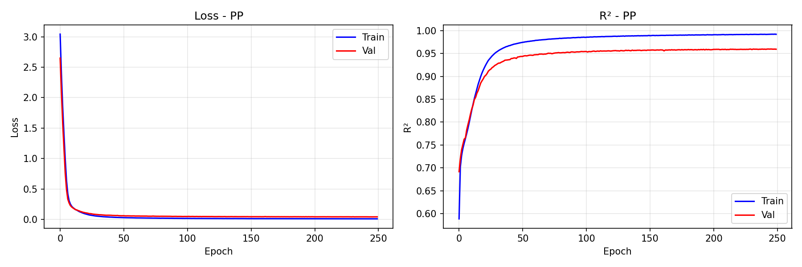
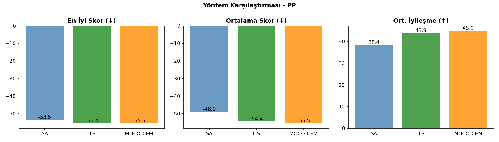
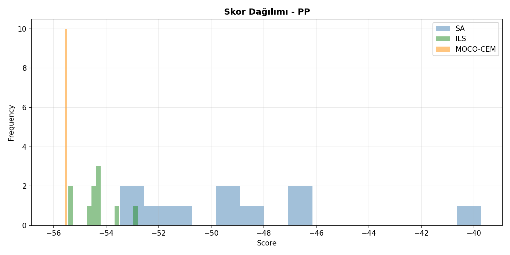
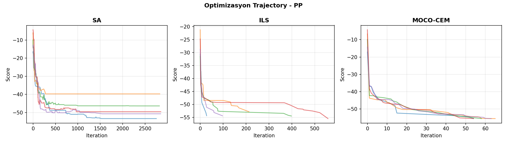
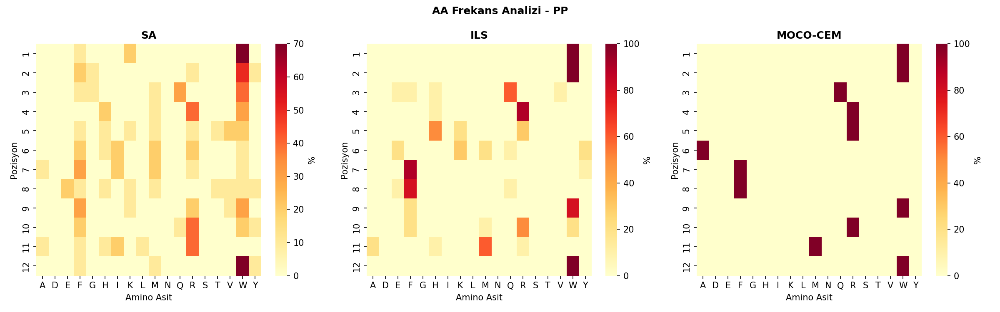

# 🧬 Peptid Üretim Karşılaştırma Raporu - PP

**Tarih:** 2026-01-06 18:24:09
**Platform:** Windows 11, RTX 4080 Super
**Model:** LSTM Encoder-Decoder (ENCDEC)

---

## 📋 Özet

- **En İyi Yöntem:** MOCO-CEM
- **En İyi Skor:** -55.53
- **En İyi Peptid:** `WWQRRAFFWRMW`
- **Model R²:** 0.9593

---

## 📊 Model Eğitim Sonuçları

### Performans Metrikleri

| Metrik | Değer | Açıklama |
|--------|-------|----------|
| **Test R²** | **0.9593** | Model açıklayıcılığı (1.0 = mükemmel) |
| Test MAE | 1.4863 | Ortalama mutlak hata |
| Test RMSE | 2.0724 | Kök ortalama kare hata |
| Best Epoch | 246 / 250 | Early stopping epoch |
| Eğitim Süresi | 1946 saniye | ~32.4 dakika |

### Model Hiperparametreleri

| Parametre | Değer |
|-----------|-------|
| Hidden Dim | 256 |
| Num Layers | 2 |
| Dropout | 0.1 |
| Learning Rate | 0.001 |
| Batch Size | 1024 |
| Lambda Score | 1.0 |
| Weight Decay | 0.0001 |
| Layer Norm | True |

### Eğitim Grafiği



---

## 🧬 Peptid Üretim Sonuçları

### Yöntem Karşılaştırması

| Yöntem | En İyi Skor | Ort. Skor | Std | İyileşme | Süre/Peptid |
|--------|-------------|-----------|-----|----------|-------------|
| **SA** | -53.48 | -48.91 | 3.90 | 38.40 | ~3s |
| **ILS** | -55.44 | -54.37 | 0.74 | 43.86 | ~48s |
| **MOCO-CEM** | -55.53 | -55.53 | 0.00 | 45.02 | ~5dk |

**🏆 En İyi Yöntem: MOCO-CEM**

### Karşılaştırma Grafikleri







---

## 📝 Üretilen Peptidler

### SA Peptidleri

| # | Peptid | Skor | Başlangıç | Başlangıç Skor | İyileşme |
|---|--------|------|-----------|----------------|----------|
| 1 | `WWQRHMFVWFHW` | -53.48 | `YQNRVSGAHGFW` | -10.55 | 42.93 |
| 2 | `WWFRKMFEWFRW` | -53.38 | `QAGGSRWDKAFM` | -17.08 | 36.29 |
| 3 | `WWMRVFMFFWRW` | -51.97 | `LYVGMFWVHQNE` | -16.75 | 35.22 |
| 4 | `FWWHRIWTKRAW` | -50.74 | `QIIFGWQNFSEI` | -14.22 | 36.52 |
| 5 | `WFQRWFIMFWRW` | -49.59 | `TQVNRAGHDGDH` | -4.28 | 45.31 |
| 6 | `WWQWTHFYRYLW` | -48.98 | `KFYMDADQTKDI` | -6.20 | 42.78 |
| 7 | `WRWWWRMHFRFW` | -48.59 | `VHQKWLGGNGNW` | -9.99 | 38.60 |
| 8 | `WFWWFIAEVRIF` | -46.38 | `YIDDVNTSMYIM` | -9.88 | 36.50 |
| 9 | `KYWHVRRWWRIY` | -46.25 | `YMYVARRMGQEK` | -9.45 | 36.80 |
| 10 | `KGGMMWIKRQRM` | -39.73 | `AFQMFNTATRIE` | -6.67 | 33.06 |

### ILS Peptidleri

| # | Peptid | Skor | Başlangıç | Başlangıç Skor | İyileşme |
|---|--------|------|-----------|----------------|----------|
| 1 | `WWQRHYFFWRMW` | -55.44 | `TQVNRAGHDGDH` | -4.28 | 51.16 |
| 2 | `WWQRHYFFWRAW` | -55.40 | `YMYVARRMGQEK` | -9.45 | 45.94 |
| 3 | `WWQRHKFFWRMW` | -54.71 | `LYVGMFWVHQNE` | -16.75 | 37.96 |
| 4 | `WWQRHKFFFWMW` | -54.44 | `YIDDVNTSMYIM` | -9.88 | 44.56 |
| 5 | `WWQRHKFFFWMW` | -54.44 | `YQNRVSGAHGFW` | -10.55 | 43.89 |
| 6 | `WWVRREYFWMAW` | -54.36 | `QIIFGWQNFSEI` | -14.22 | 40.14 |
| 7 | `WWQRRQFFWRMW` | -54.33 | `QAGGSRWDKAFM` | -17.08 | 37.24 |
| 8 | `WWERREFFWRMW` | -54.25 | `VHQKWLGGNGNW` | -9.99 | 44.27 |
| 9 | `WWFRKMFQWFHW` | -53.52 | `KFYMDADQTKDI` | -6.20 | 47.33 |
| 10 | `WWHHKMFEWFRW` | -52.80 | `AFQMFNTATRIE` | -6.67 | 46.13 |

### MOCO-CEM Peptidleri

| # | Peptid | Skor | Başlangıç | Başlangıç Skor | İyileşme |
|---|--------|------|-----------|----------------|----------|
| 1 | `WWQRRAFFWRMW` | -55.53 | `QAGGSRWDKAFM` | -17.08 | 38.44 |
| 2 | `WWQRRAFFWRMW` | -55.53 | `AFQMFNTATRIE` | -6.67 | 48.85 |
| 3 | `WWQRRAFFWRMW` | -55.53 | `YIDDVNTSMYIM` | -9.88 | 45.65 |
| 4 | `WWQRRAFFWRMW` | -55.53 | `TQVNRAGHDGDH` | -4.28 | 51.25 |
| 5 | `WWQRRAFFWRMW` | -55.53 | `QIIFGWQNFSEI` | -14.22 | 41.30 |
| 6 | `WWQRRAFFWRMW` | -55.53 | `YQNRVSGAHGFW` | -10.55 | 44.97 |
| 7 | `WWQRRAFFWRMW` | -55.53 | `VHQKWLGGNGNW` | -9.99 | 45.54 |
| 8 | `WWQRRAFFWRMW` | -55.53 | `KFYMDADQTKDI` | -6.20 | 49.33 |
| 9 | `WWQRRAFFWRMW` | -55.53 | `YMYVARRMGQEK` | -9.45 | 46.07 |
| 10 | `WWQRRAFFWRMW` | -55.53 | `LYVGMFWVHQNE` | -16.75 | 38.77 |

---

## 🔬 Amino Asit Frekans Analizi

### Genel AA Dağılımı (Tüm Yöntemler)

| AA | Frekans (%) | Görsel |
|----|-----------:|--------|
| **W** | 32.2% | ████████████████░░░░░░░░░ |
| **R** | 18.6% | █████████░░░░░░░░░░░░░░░░ |
| **F** | 16.7% | ████████░░░░░░░░░░░░░░░░░ |
| **M** | 7.8% | ███░░░░░░░░░░░░░░░░░░░░░░ |
| **Q** | 6.1% | ███░░░░░░░░░░░░░░░░░░░░░░ |
| **A** | 3.9% | █░░░░░░░░░░░░░░░░░░░░░░░░ |
| **H** | 3.9% | █░░░░░░░░░░░░░░░░░░░░░░░░ |
| **K** | 2.8% | █░░░░░░░░░░░░░░░░░░░░░░░░ |
| **Y** | 1.9% | ░░░░░░░░░░░░░░░░░░░░░░░░░ |
| **E** | 1.7% | ░░░░░░░░░░░░░░░░░░░░░░░░░ |

### Yönteme Göre En Sık Kullanılan AA'ler

| Yöntem | Top 5 AA |
|--------|----------|
| SA | W(30%), R(16%), F(15%), M(8%), H(5%) |
| ILS | W(33%), F(18%), R(15%), M(8%), H(7%) |
| MOCO-CEM | W(33%), R(25%), F(17%), A(8%), M(8%) |

### Pozisyon Bazlı AA Heatmap



---

## 🔗 Peptid Benzerlik Analizi

### En İyi Peptidler Arası Hamming Mesafesi

| | SA | ILS | MOCO-CEM |
|---|---|---|---|
| **SA** | - | 4 | 5 |
| **ILS** | 4 | - | 2 |
| **MOCO-CEM** | 5 | 2 | - |

### Ortak Motifler (En İyi 3 Peptid)

1. `WWQRRAFFWRMW` (MOCO-CEM, Skor: -55.53)
2. `WWQRRAFFWRMW` (MOCO-CEM, Skor: -55.53)
3. `WWQRRAFFWRMW` (MOCO-CEM, Skor: -55.53)

---

## 📁 Oluşturulan Dosyalar

```
PP/
├── model/
│   └── encdec_PP.pth
├── figures/
│   ├── training_curve.png
│   ├── method_comparison.png
│   ├── aa_heatmap.png
│   ├── score_distribution.png
│   └── trajectory.png
├── peptides/
│   ├── SA_peptides.csv
│   ├── ILS_peptides.csv
│   ├── MOCO-CEM_peptides.csv
│   └── all_peptides.csv
├── logs/
│   ├── training_log.json
│   └── peptide_results.json
└── RAPOR_PP.md
```

---

## 📌 Sonuç ve Öneriler

✅ **Model Performansı:** Mükemmel (R² ≥ 0.95)

**En İyi Yöntem:** MOCO-CEM (En düşük skor: -55.53)

### Yöntem Değerlendirmesi

- **SA (Simulated Annealing):** Hızlı, basit, iyi baseline
- **ILS (Iterated Local Search):** Daha derin arama, daha iyi sonuçlar
- **MOCO-CEM (Cross-Entropy):** En kapsamlı arama, en iyi sonuçlar ama yavaş

---

*Rapor otomatik olarak `peptide_generation_comparison.py` tarafından oluşturulmuştur.*
