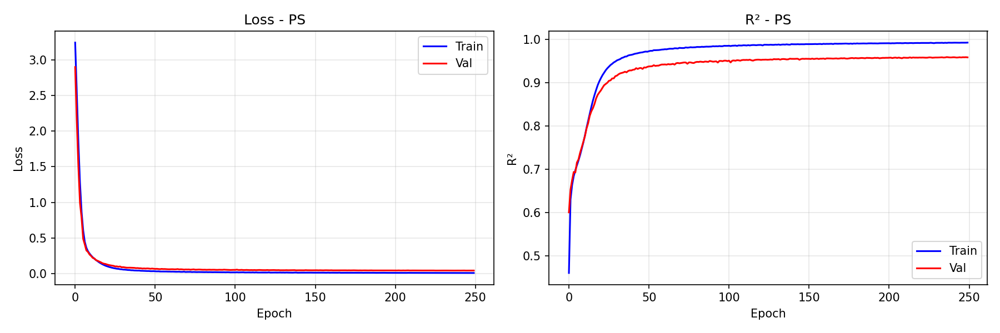
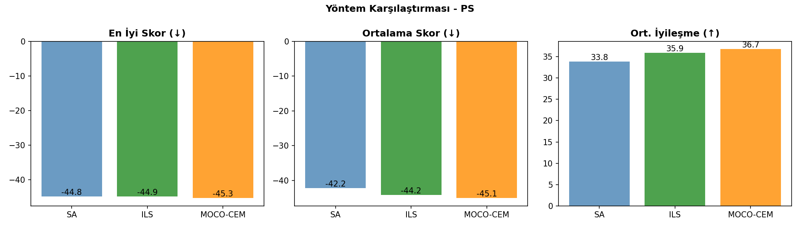
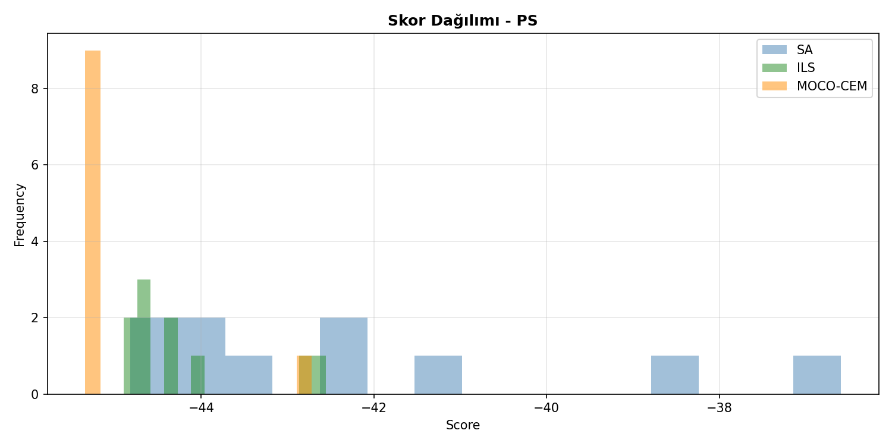
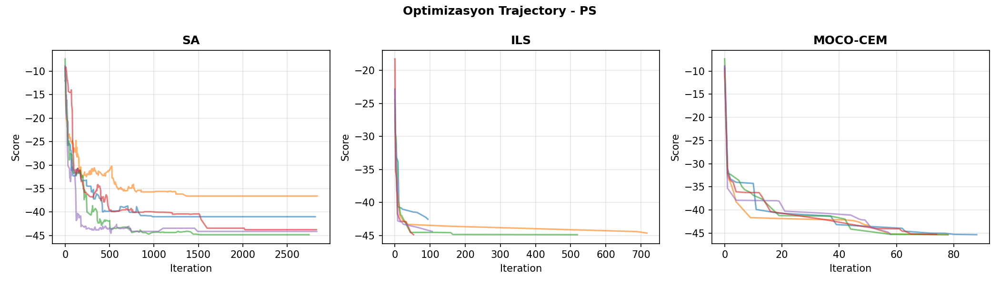
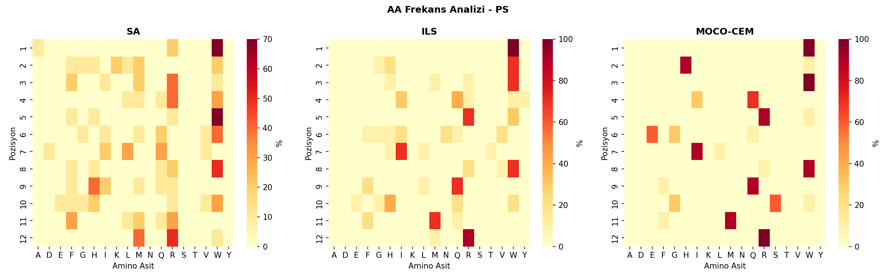

# 🧬 Peptid Üretim Karşılaştırma Raporu - PS

**Tarih:** 2026-01-07 00:02:42
**Platform:** Windows 11, RTX 4080 Super
**Model:** LSTM Encoder-Decoder (ENCDEC)

---

## 📋 Özet

- **En İyi Yöntem:** MOCO-CEM
- **En İyi Skor:** -45.34
- **En İyi Peptid:** `WHWQREIWQSMR`
- **Model R²:** 0.9583

---

## 📊 Model Eğitim Sonuçları

### Performans Metrikleri

| Metrik | Değer | Açıklama |
|--------|-------|----------|
| **Test R²** | **0.9583** | Model açıklayıcılığı (1.0 = mükemmel) |
| Test MAE | 1.2683 | Ortalama mutlak hata |
| Test RMSE | 1.8183 | Kök ortalama kare hata |
| Best Epoch | 237 / 250 | Early stopping epoch |
| Eğitim Süresi | 2063 saniye | ~34.4 dakika |

### Model Hiperparametreleri

| Parametre | Değer |
|-----------|-------|
| Hidden Dim | 256 |
| Num Layers | 3 |
| Dropout | 0.1 |
| Learning Rate | 0.001 |
| Batch Size | 1024 |
| Lambda Score | 1.0 |
| Weight Decay | 0.0001 |
| Layer Norm | True |

### Eğitim Grafiği



---

## 🧬 Peptid Üretim Sonuçları

### Yöntem Karşılaştırması

| Yöntem | En İyi Skor | Ort. Skor | Std | İyileşme | Süre/Peptid |
|--------|-------------|-----------|-----|----------|-------------|
| **SA** | -44.82 | -42.16 | 2.57 | 33.83 | ~3s |
| **ILS** | -44.90 | -44.18 | 0.81 | 35.86 | ~48s |
| **MOCO-CEM** | -45.34 | -45.06 | 0.78 | 36.73 | ~5dk |

**🏆 En İyi Yöntem: MOCO-CEM**

### Karşılaştırma Grafikleri







---

## 📝 Üretilen Peptidler

### SA Peptidleri

| # | Peptid | Skor | Başlangıç | Başlangıç Skor | İyileşme |
|---|--------|------|-----------|----------------|----------|
| 1 | `WGMRWVVFIHQM` | -44.82 | `YIDDVNTSMYIM` | -7.38 | 37.44 |
| 2 | `AHRLWWQWHERM` | -44.53 | `QIIFGWQNFSEI` | -8.89 | 35.64 |
| 3 | `WWIRRGIWQGMR` | -43.90 | `LYVGMFWVHQNE` | -12.01 | 31.89 |
| 4 | `RKRMWWQWHHRM` | -43.76 | `TQVNRAGHDGDH` | -9.43 | 34.32 |
| 5 | `RLFQWWQWHFRM` | -43.70 | `KFYMDADQTKDI` | -5.94 | 37.76 |
| 6 | `WWMWWQLRFWFR` | -42.52 | `YMYVARRMGQEK` | -8.27 | 34.25 |
| 7 | `WMRWWQLRMWFR` | -42.18 | `VHQKWLGGNGNW` | -5.34 | 36.84 |
| 8 | `WFRWWIDQRWFR` | -40.99 | `QAGGSRWDKAFM` | -9.00 | 31.99 |
| 9 | `WMFRHMLWHVMR` | -38.57 | `YQNRVSGAHGFW` | -6.51 | 32.05 |
| 10 | `WKWRFWIHIRLW` | -36.59 | `AFQMFNTATRIE` | -10.49 | 26.11 |

### ILS Peptidleri

| # | Peptid | Skor | Başlangıç | Başlangıç Skor | İyileşme |
|---|--------|------|-----------|----------------|----------|
| 1 | `WWHIRNIWQEMR` | -44.90 | `TQVNRAGHDGDH` | -9.43 | 35.46 |
| 2 | `WWWIRVIWQHMR` | -44.90 | `YIDDVNTSMYIM` | -7.38 | 37.52 |
| 3 | `WHWQRGIWQGMR` | -44.73 | `LYVGMFWVHQNE` | -12.01 | 32.72 |
| 4 | `WWWIRNIWQQMR` | -44.65 | `AFQMFNTATRIE` | -10.49 | 34.17 |
| 5 | `WWWQRVIWQHMR` | -44.64 | `YMYVARRMGQEK` | -8.27 | 36.37 |
| 6 | `WWRWRIIWQHMR` | -44.40 | `QIIFGWQNFSEI` | -8.89 | 35.51 |
| 7 | `WHWYRFIWQQMR` | -44.28 | `VHQKWLGGNGNW` | -5.34 | 38.94 |
| 8 | `WGMRWHTVLHQM` | -44.04 | `KFYMDADQTKDI` | -5.94 | 38.10 |
| 9 | `WWWQWQLRFWFR` | -42.72 | `YQNRVSGAHGFW` | -6.51 | 36.21 |
| 10 | `WWWQWIHRFWFR` | -42.56 | `QAGGSRWDKAFM` | -9.00 | 33.55 |

### MOCO-CEM Peptidleri

| # | Peptid | Skor | Başlangıç | Başlangıç Skor | İyileşme |
|---|--------|------|-----------|----------------|----------|
| 1 | `WHWQREIWQSMR` | -45.34 | `QAGGSRWDKAFM` | -9.00 | 36.34 |
| 2 | `WHWQREIWQSMR` | -45.34 | `AFQMFNTATRIE` | -10.49 | 34.86 |
| 3 | `WHWQREIWQSMR` | -45.34 | `YIDDVNTSMYIM` | -7.38 | 37.97 |
| 4 | `WHWQREIWQSMR` | -45.34 | `YQNRVSGAHGFW` | -6.51 | 38.83 |
| 5 | `WHWQREIWQSMR` | -45.34 | `YMYVARRMGQEK` | -8.27 | 37.07 |
| 6 | `WHWQREIWQSMR` | -45.34 | `LYVGMFWVHQNE` | -12.01 | 33.34 |
| 7 | `WHWIRGIWQGMR` | -45.27 | `TQVNRAGHDGDH` | -9.43 | 35.84 |
| 8 | `WHWIRGIWQGMR` | -45.27 | `QIIFGWQNFSEI` | -8.89 | 36.38 |
| 9 | `WHWIRGIWQGMR` | -45.27 | `VHQKWLGGNGNW` | -5.34 | 39.94 |
| 10 | `WWWQWQLRFWFR` | -42.72 | `KFYMDADQTKDI` | -5.94 | 36.78 |

---

## 🔬 Amino Asit Frekans Analizi

### Genel AA Dağılımı (Tüm Yöntemler)

| AA | Frekans (%) | Görsel |
|----|-----------:|--------|
| **W** | 28.3% | ██████████████░░░░░░░░░░░ |
| **R** | 17.5% | ████████░░░░░░░░░░░░░░░░░ |
| **Q** | 11.4% | █████░░░░░░░░░░░░░░░░░░░░ |
| **M** | 8.6% | ████░░░░░░░░░░░░░░░░░░░░░ |
| **I** | 8.3% | ████░░░░░░░░░░░░░░░░░░░░░ |
| **H** | 7.5% | ███░░░░░░░░░░░░░░░░░░░░░░ |
| **F** | 4.7% | ██░░░░░░░░░░░░░░░░░░░░░░░ |
| **G** | 3.3% | █░░░░░░░░░░░░░░░░░░░░░░░░ |
| **L** | 2.5% | █░░░░░░░░░░░░░░░░░░░░░░░░ |
| **E** | 2.2% | █░░░░░░░░░░░░░░░░░░░░░░░░ |

### Yönteme Göre En Sık Kullanılan AA'ler

| Yöntem | Top 5 AA |
|--------|----------|
| SA | W(28%), R(19%), M(11%), F(8%), H(8%) |
| ILS | W(31%), R(17%), Q(12%), I(10%), H(8%) |
| MOCO-CEM | W(27%), R(17%), Q(14%), I(10%), H(8%) |

### Pozisyon Bazlı AA Heatmap



---

## 🔗 Peptid Benzerlik Analizi

### En İyi Peptidler Arası Hamming Mesafesi

| | SA | ILS | MOCO-CEM |
|---|---|---|---|
| **SA** | - | 11 | 11 |
| **ILS** | 11 | - | 5 |
| **MOCO-CEM** | 11 | 5 | - |

### Ortak Motifler (En İyi 3 Peptid)

1. `WHWQREIWQSMR` (MOCO-CEM, Skor: -45.34)
2. `WHWQREIWQSMR` (MOCO-CEM, Skor: -45.34)
3. `WHWQREIWQSMR` (MOCO-CEM, Skor: -45.34)

---

## 📁 Oluşturulan Dosyalar

```
PS/
├── model/
│   └── encdec_PS.pth
├── figures/
│   ├── training_curve.png
│   ├── method_comparison.png
│   ├── aa_heatmap.png
│   ├── score_distribution.png
│   └── trajectory.png
├── peptides/
│   ├── SA_peptides.csv
│   ├── ILS_peptides.csv
│   ├── MOCO-CEM_peptides.csv
│   └── all_peptides.csv
├── logs/
│   ├── training_log.json
│   └── peptide_results.json
└── RAPOR_PS.md
```

---

## 📌 Sonuç ve Öneriler

✅ **Model Performansı:** Mükemmel (R² ≥ 0.95)

**En İyi Yöntem:** MOCO-CEM (En düşük skor: -45.34)

### Yöntem Değerlendirmesi

- **SA (Simulated Annealing):** Hızlı, basit, iyi baseline
- **ILS (Iterated Local Search):** Daha derin arama, daha iyi sonuçlar
- **MOCO-CEM (Cross-Entropy):** En kapsamlı arama, en iyi sonuçlar ama yavaş

---

*Rapor otomatik olarak `peptide_generation_comparison.py` tarafından oluşturulmuştur.*
