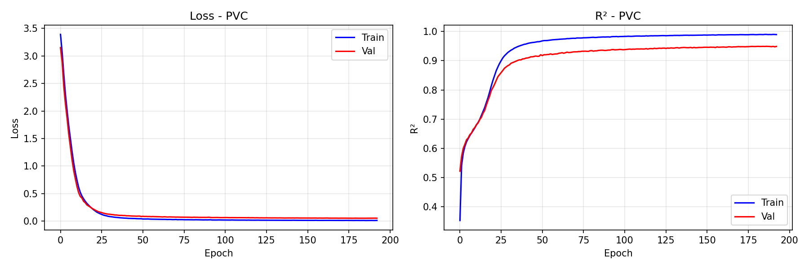
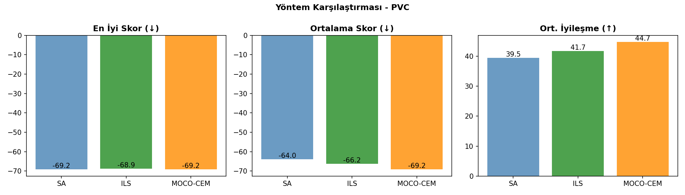
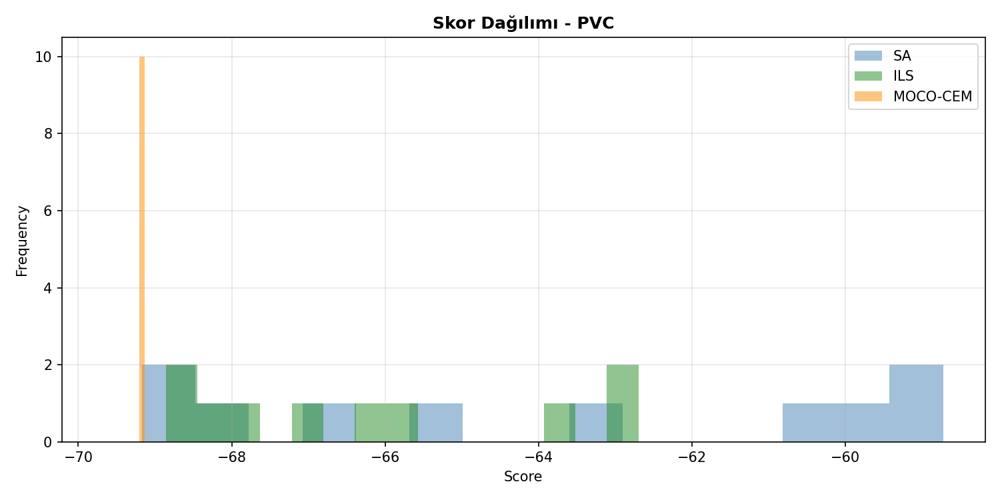
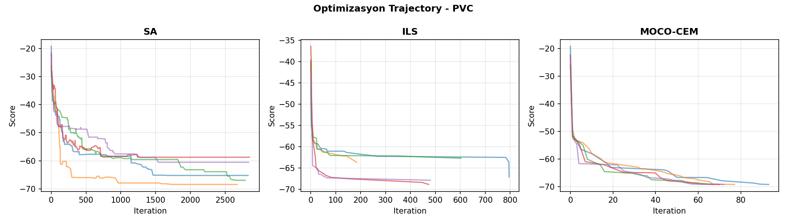
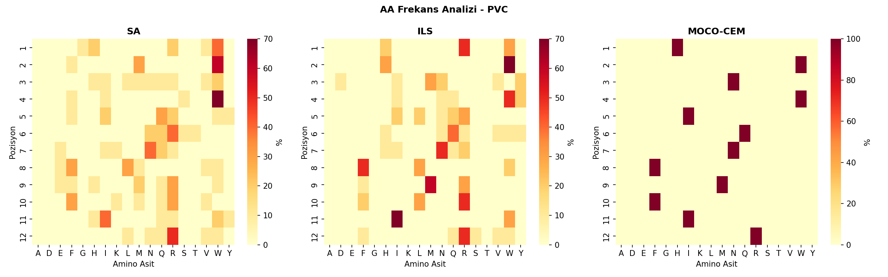

# 🧬 Peptid Üretim Karşılaştırma Raporu - PVC

**Tarih:** 2026-01-06 22:07:52
**Platform:** Windows 11, RTX 4080 Super
**Model:** LSTM Encoder-Decoder (ENCDEC)

---

## 📋 Özet

- **En İyi Yöntem:** MOCO-CEM
- **En İyi Skor:** -69.17
- **En İyi Peptid:** `HWNWIQNFMFIR`
- **Model R²:** 0.9489

---

## 📊 Model Eğitim Sonuçları

### Performans Metrikleri

| Metrik | Değer | Açıklama |
|--------|-------|----------|
| **Test R²** | **0.9489** | Model açıklayıcılığı (1.0 = mükemmel) |
| Test MAE | 1.7149 | Ortalama mutlak hata |
| Test RMSE | 2.3988 | Kök ortalama kare hata |
| Best Epoch | 178 / 250 | Early stopping epoch |
| Eğitim Süresi | 1343 saniye | ~22.4 dakika |

### Model Hiperparametreleri

| Parametre | Değer |
|-----------|-------|
| Hidden Dim | 256 |
| Num Layers | 3 |
| Dropout | 0.1 |
| Learning Rate | 0.001 |
| Batch Size | 1024 |
| Lambda Score | 1.0 |
| Weight Decay | 0.0001 |
| Layer Norm | True |

### Eğitim Grafiği



---

## 🧬 Peptid Üretim Sonuçları

### Yöntem Karşılaştırması

| Yöntem | En İyi Skor | Ort. Skor | Std | İyileşme | Süre/Peptid |
|--------|-------------|-----------|-----|----------|-------------|
| **SA** | -69.17 | -63.96 | 3.99 | 39.47 | ~3s |
| **ILS** | -68.86 | -66.20 | 2.29 | 41.71 | ~48s |
| **MOCO-CEM** | -69.17 | -69.17 | 0.00 | 44.67 | ~5dk |

**🏆 En İyi Yöntem: MOCO-CEM**

### Karşılaştırma Grafikleri







---

## 📝 Üretilen Peptidler

### SA Peptidleri

| # | Peptid | Skor | Başlangıç | Başlangıç Skor | İyileşme |
|---|--------|------|-----------|----------------|----------|
| 1 | `HWNWIQNFMFIR` | -69.17 | `VHQKWLGGNGNW` | -25.59 | 43.58 |
| 2 | `WWHWRNNFQFYR` | -68.59 | `KFYMDADQTKDI` | -25.23 | 43.36 |
| 3 | `HWVWQQNFMRIR` | -68.42 | `AFQMFNTATRIE` | -25.43 | 42.99 |
| 4 | `WWRWQNQMFFIR` | -66.92 | `YIDDVNTSMYIM` | -26.17 | 40.76 |
| 5 | `WWWWISNEERQR` | -65.21 | `QAGGSRWDKAFM` | -19.25 | 45.96 |
| 6 | `RFWWQTRVHRIW` | -63.12 | `YQNRVSGAHGFW` | -23.11 | 40.01 |
| 7 | `RMISFRKLRVWV` | -60.52 | `QIIFGWQNFSEI` | -22.51 | 38.01 |
| 8 | `GMLFYRQLRKWN` | -59.64 | `LYVGMFWVHQNE` | -27.57 | 32.07 |
| 9 | `VMMIWRILRQHQ` | -59.29 | `YMYVARRMGQEK` | -27.63 | 31.66 |
| 10 | `WWQWRREWWMRL` | -58.72 | `TQVNRAGHDGDH` | -22.46 | 36.26 |

### ILS Peptidleri

| # | Peptid | Skor | Başlangıç | Başlangıç Skor | İyileşme |
|---|--------|------|-----------|----------------|----------|
| 1 | `WWIWIQNFMRIR` | -68.86 | `TQVNRAGHDGDH` | -22.46 | 46.40 |
| 2 | `WWNWIQNFMFIR` | -68.67 | `YQNRVSGAHGFW` | -23.11 | 45.56 |
| 3 | `HWNWLQNFMRIR` | -68.32 | `LYVGMFWVHQNE` | -27.57 | 40.75 |
| 4 | `WWDWRHNFFFIR` | -67.86 | `QIIFGWQNFSEI` | -22.51 | 45.35 |
| 5 | `HWVWQNNFMRIR` | -67.09 | `QAGGSRWDKAFM` | -19.25 | 47.84 |
| 6 | `RWYQNVRWMRIF` | -66.33 | `YMYVARRMGQEK` | -27.63 | 38.70 |
| 7 | `RWYNLQRWMRIW` | -65.85 | `KFYMDADQTKDI` | -25.23 | 40.61 |
| 8 | `RHMYRWILRLWQ` | -63.65 | `AFQMFNTATRIE` | -25.43 | 38.22 |
| 9 | `RHMIRYQLRLWV` | -62.70 | `YIDDVNTSMYIM` | -26.17 | 36.54 |
| 10 | `RHMYQRHLRLWS` | -62.70 | `VHQKWLGGNGNW` | -25.59 | 37.11 |

### MOCO-CEM Peptidleri

| # | Peptid | Skor | Başlangıç | Başlangıç Skor | İyileşme |
|---|--------|------|-----------|----------------|----------|
| 1 | `HWNWIQNFMFIR` | -69.17 | `QAGGSRWDKAFM` | -19.25 | 49.92 |
| 2 | `HWNWIQNFMFIR` | -69.17 | `AFQMFNTATRIE` | -25.43 | 43.74 |
| 3 | `HWNWIQNFMFIR` | -69.17 | `YIDDVNTSMYIM` | -26.17 | 43.00 |
| 4 | `HWNWIQNFMFIR` | -69.17 | `TQVNRAGHDGDH` | -22.46 | 46.71 |
| 5 | `HWNWIQNFMFIR` | -69.17 | `QIIFGWQNFSEI` | -22.51 | 46.66 |
| 6 | `HWNWIQNFMFIR` | -69.17 | `YQNRVSGAHGFW` | -23.11 | 46.06 |
| 7 | `HWNWIQNFMFIR` | -69.17 | `VHQKWLGGNGNW` | -25.59 | 43.58 |
| 8 | `HWNWIQNFMFIR` | -69.17 | `KFYMDADQTKDI` | -25.23 | 43.93 |
| 9 | `HWNWIQNFMFIR` | -69.17 | `YMYVARRMGQEK` | -27.63 | 41.54 |
| 10 | `HWNWIQNFMFIR` | -69.17 | `LYVGMFWVHQNE` | -27.57 | 41.60 |

---

## 🔬 Amino Asit Frekans Analizi

### Genel AA Dağılımı (Tüm Yöntemler)

| AA | Frekans (%) | Görsel |
|----|-----------:|--------|
| **W** | 18.6% | █████████░░░░░░░░░░░░░░░░ |
| **R** | 15.6% | ███████░░░░░░░░░░░░░░░░░░ |
| **I** | 11.4% | █████░░░░░░░░░░░░░░░░░░░░ |
| **F** | 10.8% | █████░░░░░░░░░░░░░░░░░░░░ |
| **N** | 10.6% | █████░░░░░░░░░░░░░░░░░░░░ |
| **Q** | 8.6% | ████░░░░░░░░░░░░░░░░░░░░░ |
| **M** | 7.5% | ███░░░░░░░░░░░░░░░░░░░░░░ |
| **H** | 6.1% | ███░░░░░░░░░░░░░░░░░░░░░░ |
| **L** | 3.6% | █░░░░░░░░░░░░░░░░░░░░░░░░ |
| **V** | 2.2% | █░░░░░░░░░░░░░░░░░░░░░░░░ |

### Yönteme Göre En Sık Kullanılan AA'ler

| Yöntem | Top 5 AA |
|--------|----------|
| SA | W(21%), R(18%), Q(10%), F(8%), I(8%) |
| ILS | R(20%), W(18%), I(10%), N(8%), F(8%) |
| MOCO-CEM | F(17%), I(17%), N(17%), W(17%), H(8%) |

### Pozisyon Bazlı AA Heatmap



---

## 🔗 Peptid Benzerlik Analizi

### En İyi Peptidler Arası Hamming Mesafesi

| | SA | ILS | MOCO-CEM |
|---|---|---|---|
| **SA** | - | 3 | 0 |
| **ILS** | 3 | - | 3 |
| **MOCO-CEM** | 0 | 3 | - |

### Ortak Motifler (En İyi 3 Peptid)

1. `HWNWIQNFMFIR` (MOCO-CEM, Skor: -69.17)
2. `HWNWIQNFMFIR` (MOCO-CEM, Skor: -69.17)
3. `HWNWIQNFMFIR` (MOCO-CEM, Skor: -69.17)

---

## 📁 Oluşturulan Dosyalar

```
PVC/
├── model/
│   └── encdec_PVC.pth
├── figures/
│   ├── training_curve.png
│   ├── method_comparison.png
│   ├── aa_heatmap.png
│   ├── score_distribution.png
│   └── trajectory.png
├── peptides/
│   ├── SA_peptides.csv
│   ├── ILS_peptides.csv
│   ├── MOCO-CEM_peptides.csv
│   └── all_peptides.csv
├── logs/
│   ├── training_log.json
│   └── peptide_results.json
└── RAPOR_PVC.md
```

---

## 📌 Sonuç ve Öneriler

✅ **Model Performansı:** Çok İyi (R² ≥ 0.90)

**En İyi Yöntem:** MOCO-CEM (En düşük skor: -69.17)

### Yöntem Değerlendirmesi

- **SA (Simulated Annealing):** Hızlı, basit, iyi baseline
- **ILS (Iterated Local Search):** Daha derin arama, daha iyi sonuçlar
- **MOCO-CEM (Cross-Entropy):** En kapsamlı arama, en iyi sonuçlar ama yavaş

---

*Rapor otomatik olarak `peptide_generation_comparison.py` tarafından oluşturulmuştur.*
